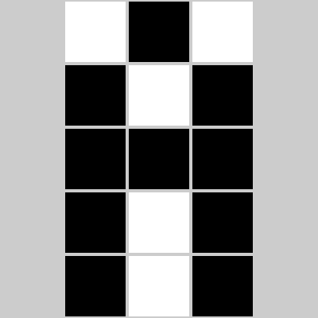

# Code.org Grapher
Yesterday, in AP Computer Science Principles, I was supposed to draw a black-and-white picture in [code.org](https://code.org)'s b&w image widget. The format is a two-byte header (one byte representing the width and the other the height), and a stream of bits, each one representing a black or white pixel (0 for black, 1 for white).

#### Example:
```
0000 0011
0000 0101
101010000010010
```
becomes


## 
